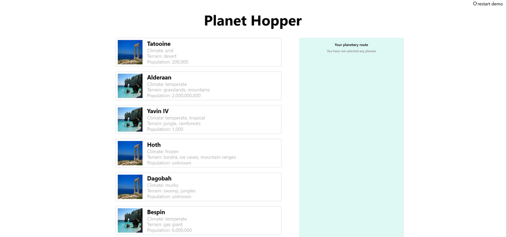
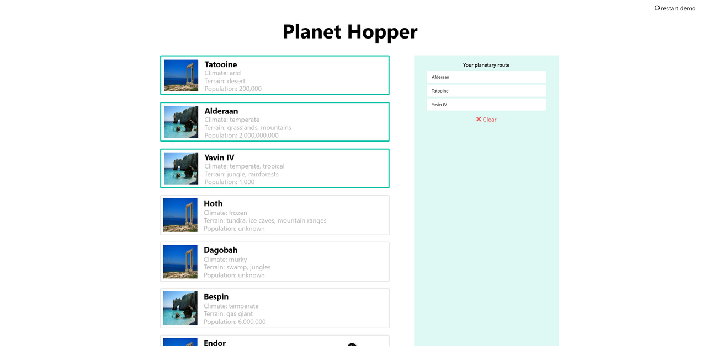
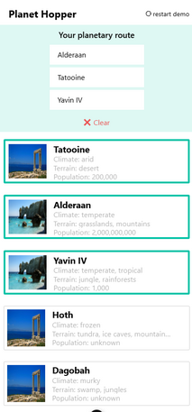
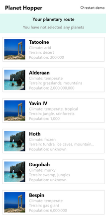

# Planet Hopper

## Description

Planet Hopper is a Nuxt 3 application that allows users to explore and select routes between different planets. Users can select up to 5 planets, clear their selection, or restart the demo.
The app fetches planet data from an external API and displays it in a user-friendly interface.

## Features

- **Explore Planets**: View detailed information about various planets, including climate, terrain, and population.
- **Select Routes**: Choose up to 5 planets to create a custom planetary route.
- **Clear Selection**: Easily clear your selected planets with a single click.
- **Restart Demo**: Reset the application to its initial state to start over.
- **Responsive Design**: Optimized for both desktop and mobile devices using Tailwind CSS.

## Technologies Used

- **Nuxt 3**: A modern framework for building Vue.js applications.
- **Tailwind CSS**: A utility-first CSS framework for styling.
- **Vitest**: A fast and lightweight testing framework for Vue components.

## Installation

1. **Clone the Repository**:

   ```bash
   git clone https://github.com/IraklisAsimakopoulos/planethopper-app.git
   ```

2. **Navigate to the project directory**:

   ```bash
   cd notes-app
   ```

3. **Install Dependencies**:

   ```bash
   npm install
   ```

## Usage

1. **Run the Development Server**:

   ```bash
   npm run dev
   ```

2. **Open your browser** and go to [http://localhost:3000](http://localhost:3000) to view the app.

## Testing

1. **Run Tests**:

   ```bash
   npm run test
   ```

   **With watch option on**:

   ```bash
   npm run test:watch
   ```

## Usage

- **Select Planets**: Click on a planet card to add it to your route.
- **Clear Route**: Click the "Clear" button to remove all selected planets.
- **Restart Demo**: Click "Restart Demo" to reset the application.

## Screenshots

### Desktop


_Desktop screenshot with not selected planets_

_Desktop screenshot with selected planets_

### Mobile


_Mobile screenshot with not selected planets_


_Mobile screenshot with selected planets_

## Contributing

Contributions are welcome! Please fork the repository and submit a pull request for any improvements or bug fixes.

## License

This project is licensed under the MIT License - see the [LICENSE](LICENSE) file for details.

## Contact

Iraklis Asimakopoulos-Kouloulias - [iraklis.asimakopoulos@gmail.com](mailto:iraklis.asimakopoulos@gmail.com)

Project Link: [https://github.com/IraklisAsimakopoulos/planethopper-app](https://github.com/IraklisAsimakopoulos/planethopper-app)
